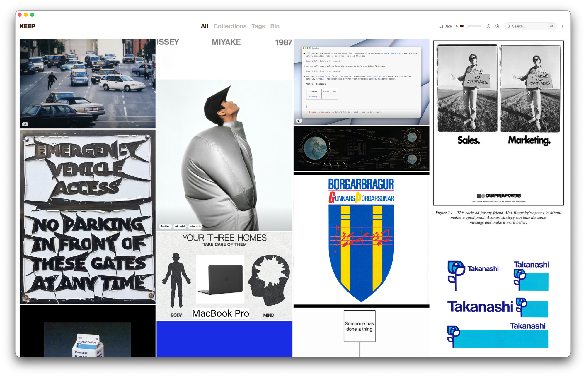
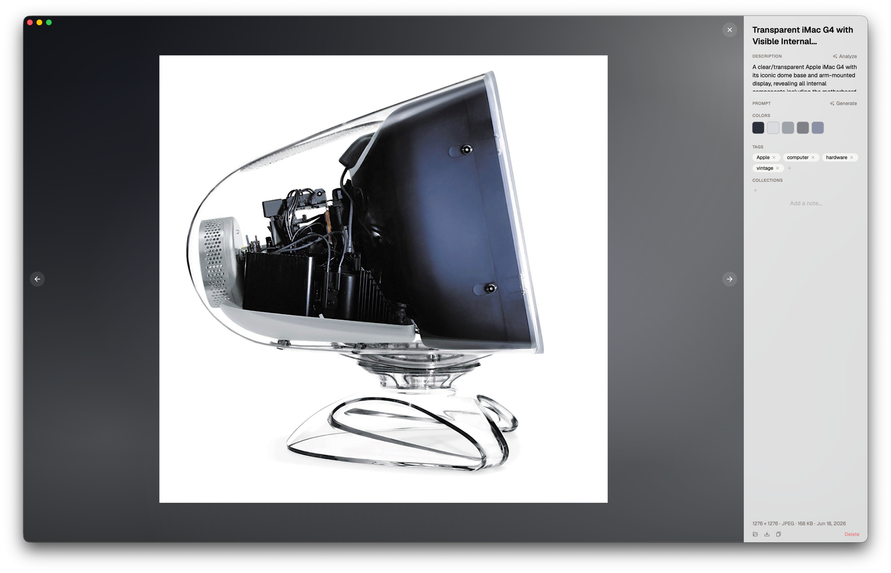
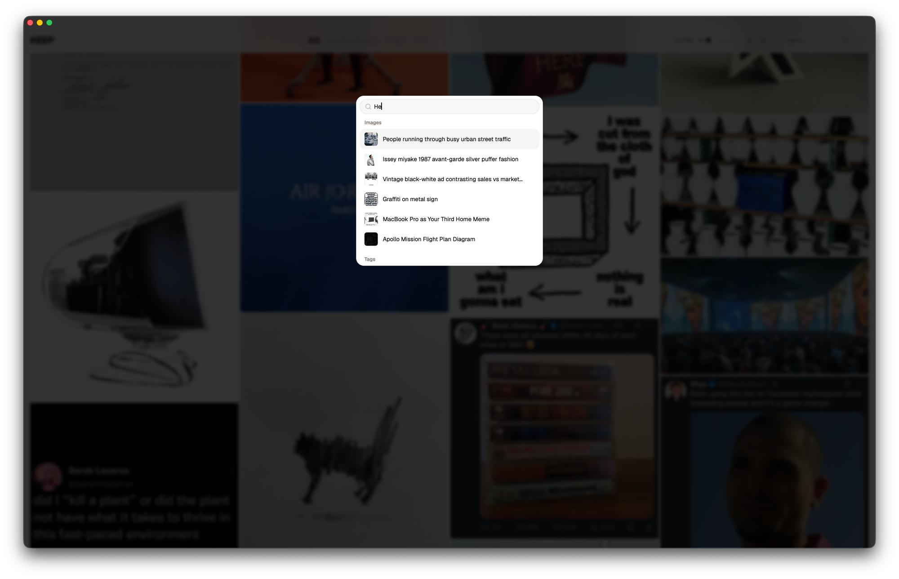

# KEEP

> A desktop app for keeping images you'll definitely use someday.

KEEP is a local-first macOS app for saving, organizing, and browsing visual inspiration.  Without the algorithm deciding what you want to see.



 

## What it does

- **Drag images in.** Or paste them. Or pick files. 

- **Browse them** in a masonry grid that you can resize because a fixed layout can't be trusted.

- **Tag and organize** into collections, future-you will definitely remember what "vibes 3" means.

- **AI analysis** sends your images to an LLM that returns a title, tags, and description. Eerily accurate. Mildly unsettling. 

- **Generate prompts** and turn your inspiration into a slightly worse version of it.

- **Lightbox** full-screen view with a frosted glass sidebar and a gradient backdrop extracted from the image's color palette. Aesthetics matter in the tools you use to steal aesthetics.

- **OCR** extracts text from images. Screenshots, posters, book pages — if there's text in it, you can search for it.

- **Copy** ⌘C copies the image to your clipboard. For videos it copies the current frame, which is more useful than it sounds.

- **Search** ⌘K dialog. Keywords, tags, collections, OCR text, AI descriptions.

- **Bin** soft delete. 90-day auto-purge. It's not gone, it's just resting.

## Shortcuts

| Key | Action |
|---|---|
| ⌘K | Search palette |
| ⌘F | Focus search bar |
| ⌘, | Settings |
| ← → | Navigate lightbox |
| ⌘C | Copy to clipboard |
| ⌫ | Delete (lightbox) |
| E | Edit title |
| A | Analyze |
| Scroll | Zoom in/out |
| 0 | Reset zoom |
| Drag | Pan when zoomed |
| Dbl-click | Toggle 2× zoom |
| Esc | Close |
| Del | Delete selected |
| ⌘+click | Multi-select |
| Shift+click | Range select |
| ? | This list |

## AI: cloud or local

Two options:

**OpenRouter** paste an API key in Settings, pick a model, done. Fast, accurate, costs fractions of a cent per image. Requires trusting a third party with your mood board of screenshots and you figuring out how to make an API key.

**Local models** macOS Vision Framework handles silent background tagging (no API key, no internet, no opinions). Moondream2 (~1.3 GB, runs on-device) for richer descriptions. Slower, private, morally superior.

Both can run. Neither is required. The app works fine as an image box if you just want to drag things in.

## Install

Download the latest `.dmg` from [Releases](../../releases/latest), open it, drag KEEP to Applications.

First launch will be blocked by macOS because the app isn't signed by a registered developer because who needs developers. To open it anyway:

**System Settings → Privacy & Security → scroll down → "Open Anyway"**

You'll only have to do this once.

## What it doesn't do

- Cloud sync ( `synced_at` is in the schema, could change)

- Windows

- Make you more creative

## Stack

Built with Tauri (Rust backend, learning project), React, TypeScript, Vite, Tailwind CSS, SQLite, and a concerning amount of time spent getting it to not look broken.

Fonts: Geist Variable (temporary) while we fight with a custom typeface that has `sTypoLineGap: 324` a number so large it is either a bug or a statement.

## Running it

```sh
bun install
bun run tauri dev
```

For browser preview (Tauri APIs mocked, seed data):

```sh
bun run browser
```

## Requirements

- macOS
- Rust toolchain
- `brew install libheif` (for HEIC/HEIF support)
- An OpenRouter API key if you want the AI features, which you do

## Status

Actively developed. Not stable. Not versioned. Named three different things at various points in its life. Currently KEEP.
